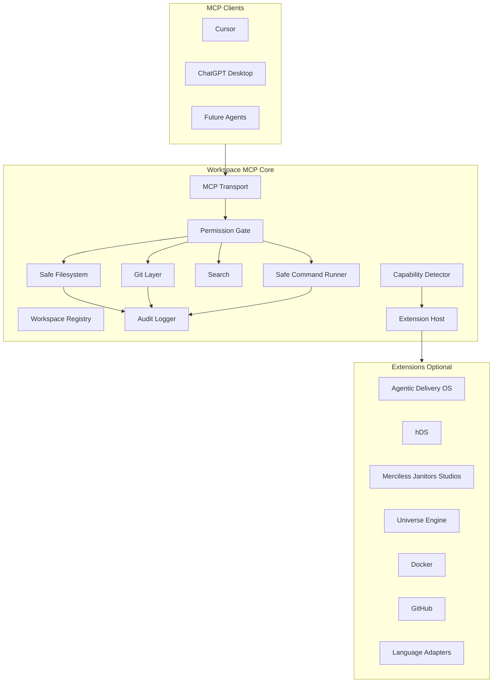

# Extension Architecture

Workspace MCP is a **platform**: a security-critical **core** plus **optional extensions** for domain-specific tools.

## Core Principle

> The core must boot, authorize, audit, and serve base developer tools **without any extension loaded**.

Extensions enhance. They never define the platform.

## Layer Model



## Core Boundary

| Concern | Stays in core |
|---------|---------------|
| Workspace registration | Yes — trust anchor |
| Path canonicalization | Yes — security |
| Authorization | Yes — security |
| Audit logging | Yes — compliance |
| MCP transport | Yes — platform |
| Base FS / Git read | Yes — universal |
| Capability detection signals | Yes — adaptation |
| Extension host contract | Yes — platform |
| Tool namespace routing | Yes — prevent collisions |

## Extension Boundary

| Extension | Provides (hypothesis) | Depends on |
|-----------|----------------------|------------|
| **agentic-delivery-os** | Capsule validate, AGENT_* workflows, doctrine review | hDS optional |
| **hds** | doc_id lookup, front-matter-safe edits | — |
| **merciless-janitors-studios** | Studio release packs, internal templates | ados optional |
| **universe-engine** | Engine project tools | — |
| **docker** | Container inspect/run | gated |
| **github** | PR/issue API | network gated |
| **figma** | Design bridge | network gated |
| **postgresql** | Schema/query tools | gated |
| **nodejs / python / rust / react** | Lint, test, build helpers | language signals |

## Extension Manifest (Hypothesis)

```yaml
extension:
  id: agentic-delivery-os
  version: "0.1.0"
  requires_capabilities: [ados]
  provides_tools: [validate_capsule, open_capsule, record_decision]
  permissions_required: [ados:read, ados:mutate]
```

Extensions load only from **configured paths**—never implicitly from repo content alone.

## Merciless Janitors Studios

MJS is a **consumer** and **extension author**, not product owner. Studio tools live in `extensions/merciless-janitors-studios/` (separate package hypothesis)—**never imported by core**.

## Failure Modes

| Scenario | Behavior |
|----------|----------|
| Extension fails to load | Core continues; audit warning |
| Extension over-privileged | Auth gate denies |
| No matching extension | Core tools only |
| Multiple extensions | Union of tools ∩ grant |

## ADR

`docs/architecture/adr-0004-core-extension-boundary.md`

## Open Questions

- DQ-EXT-001: In-repo `extensions/` vs external plugin packages
- DQ-EXT-002: Extension signing/trust model
- DQ-EXT-003: Hot reload vs restart
